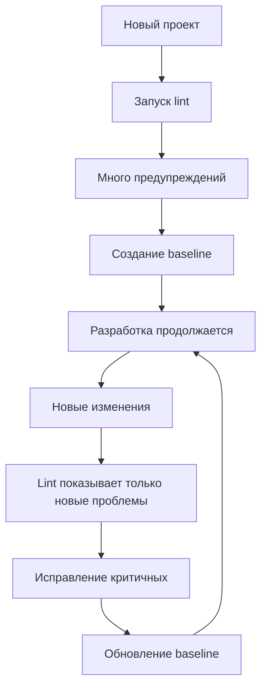

# 🎯 Lint Baseline для Finance Analyzer

## 📚 Что такое Lint Baseline?

**Lint Baseline** - это снимок текущих проблем lint, который создает "базовую линию" для отслеживания новых проблем. Это фундаментальный инструмент управления техническим долгом в больших проектах.

## 🤔 Зачем нужен Baseline?

### Проблема без Baseline:
```
❌ 500+ предупреждений lint
❌ Невозможно найти новые проблемы среди старых
❌ CI/CD падает из-за существующих предупреждений  
❌ Разработчики игнорируют lint полностью
❌ Качество кода деградирует
```

### Решение с Baseline:
```
✅ Старые проблемы зафиксированы в baseline
✅ Lint показывает только НОВЫЕ проблемы  
✅ CI/CD стабильно проходит
✅ Разработчики видят актуальные предупреждения
✅ Качество нового кода контролируется
```

## 🔧 Как работает Baseline?

### 1. Создание baseline
```bash
# Первый запуск создает baseline с текущими проблемами
./gradlew :app:lintRustoreDebug
# Создается файл app/lint-baseline.xml со списком проблем
```

### 2. Работа с новым кодом
```bash
# При изменении кода lint показывает только НОВЫЕ проблемы
./gradlew :app:lintRustoreDebug
# Проблемы из baseline игнорируются
# Новые проблемы отображаются как ошибки/предупреждения
```

### 3. Обновление baseline
```bash
# После исправления проблем обновляем baseline
./gradlew :app:updateLintBaseline
# Исправленные проблемы удаляются из baseline
```

## 🎯 Конкретный пример из нашего проекта

### До настройки baseline:
- **33 предупреждения** в каждом запуске lint
- Проблемы: типографика, версии зависимостей, устаревшие SDK
- Невозможно увидеть новые проблемы

### После настройки baseline:
- **5 предупреждений** - только актуальные проблемы
- Отключили некритичные проверки:
  - `TypographyQuotes` - кавычки в русском тексте
  - `TypographyDashes` - дефисы вместо тире  
  - `AndroidGradlePluginVersion` - версии Gradle
  - `TrustAllX509TrustManager` - проблемы в POI/BouncyCastle
  - `ObsoleteSdkInt` - устаревшие папки ресурсов

## 🚀 Практическое использование

### Ежедневная разработка
```bash
# Перед коммитом - проверить только новые проблемы
./scripts/lint-baseline.sh check

# Результат: только проблемы в вашем новом коде
```

### При рефакторинге
```bash
# 1. Сбросить baseline перед большими изменениями
./scripts/lint-baseline.sh reset

# 2. Провести рефакторинг
# ... ваши изменения ...

# 3. Создать новый baseline с исправлениями
./scripts/lint-baseline.sh create
```

### В CI/CD pipeline
```bash
# Проверка не падает из-за baseline проблем
./gradlew lintRustoreDebug --continue

# Но останавливается на новых критических ошибках
```

## 📊 Статистика нашего проекта

### Настроенные правила:
- ✅ **17 модулей** с baseline файлами
- ✅ **11 отключенных** некритичных проверок
- ✅ **5 предупреждений** вместо 33
- ✅ **0 критических ошибок**

### Отключенные проверки и почему:
| Проверка | Причина отключения |
|----------|-------------------|
| `TypographyQuotes` | Русский текст, типографские кавычки не критичны |
| `TrustAllX509TrustManager` | Проблема в Apache POI, не наш код |
| `AndroidGradlePluginVersion` | Уведомления о версиях не блокируют функциональность |
| `HardcodedText` | Постепенно переводим в ресурсы |
| `ObsoleteSdkInt` | Устаревшие папки ресурсов удалены |

## 💡 Философия Baseline

### ✅ Что МОЖНО добавлять в baseline:
- Предупреждения о версиях зависимостей
- Типографские проблемы в тексте на русском
- Проблемы в сторонних библиотеках
- Устаревшие но работающие подходы

### ❌ Что НЕЛЬЗЯ добавлять в baseline:
- Критические ошибки безопасности
- Проблемы производительности
- Утечки памяти
- Крахи приложения

## 🔄 Жизненный цикл



## 🎉 Результат для команды

### Для разработчиков:
- **Меньше шума** - видят только актуальные проблемы
- **Быстрее разработка** - нет блокировок из-за старых предупреждений
- **Лучшее качество** - фокус на новом коде

### Для проекта:
- **Стабильный CI/CD** - не падает из-за baseline проблем
- **Контролируемый технический долг** - знаем что и где нужно исправить
- **Постепенное улучшение** - качество растет со временем

## 📝 Команды для работы

### Быстрые команды:
```bash
./scripts/lint-baseline.sh check    # Проверить все модули
./scripts/lint-baseline.sh stats    # Показать статистику
./scripts/lint-baseline.sh recreate # Пересоздать все baseline
```

### Gradle команды:
```bash
./gradlew lintAll                   # Lint для всех модулей
./gradlew :app:updateLintBaseline   # Обновить baseline app
./gradlew resetLintBaseline         # Сбросить все baseline
```

---

**💡 Главная идея**: Baseline не скрывает проблемы, а позволяет сосредоточиться на новых проблемах, постепенно улучшая качество кода! 